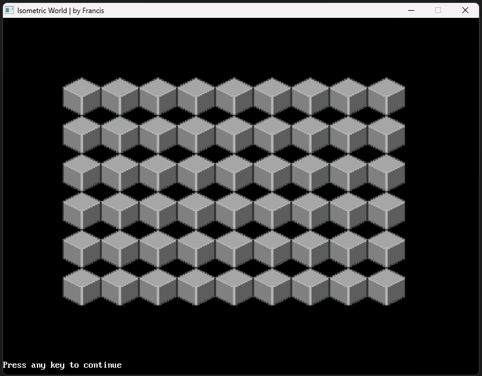
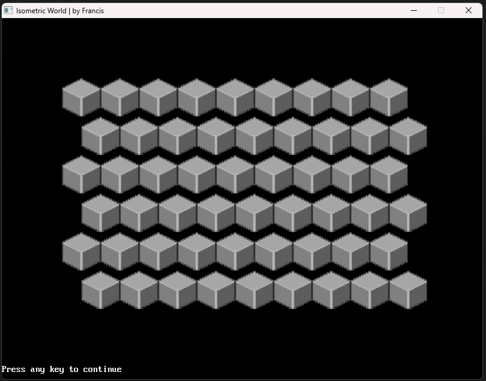
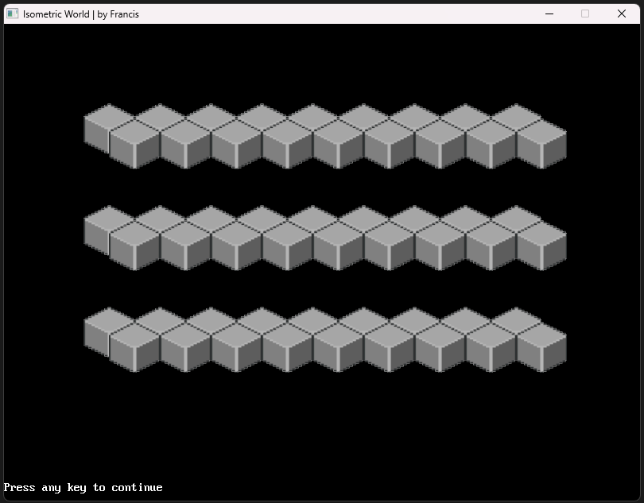
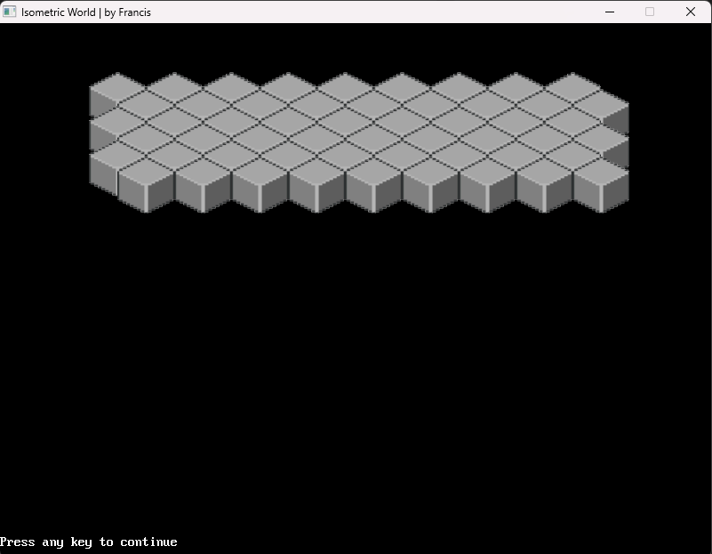
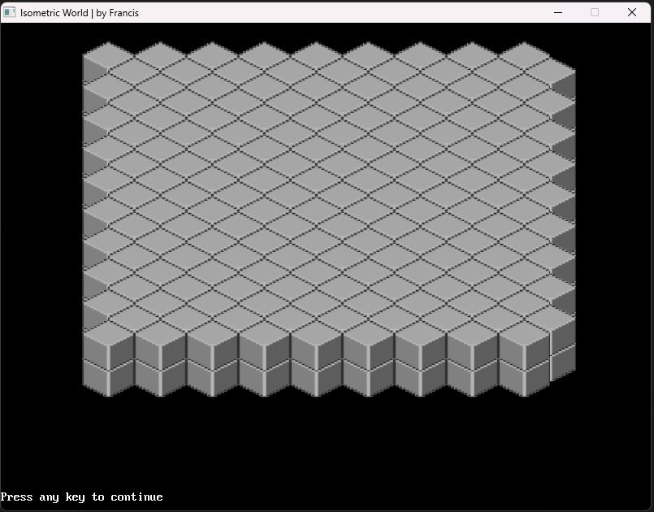
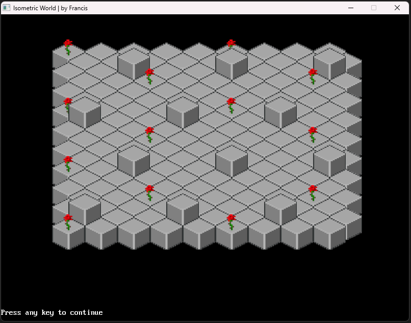

# Isometric Rendering 🧊

My Idea is to experiment with isometric rendering. I want to make a game using isometric tiles (or cubes) but I have never experimented with that sort of rendering style, so I figured that I'll try out myself in a simple rendering project. 

```
This project is finished. It's all about the journey and not the end product 
but you can download the artifact (demo executable) to check it out yourself.
You can dowlnoad the zip archive below and extract the program and the 
resource images folder.
```

**⚠️ Disclaimer: I do not own the rights to the resource images, it's educational purposes only - use everything at your own risk and judgement**

Windows: [⬇️ download zip](./dist/demo-program-exe.zip) 

Release: 🟢 Available | `0.1 demo` 


### 1) Interlaced rendering. 

I figured out that I have to do interlaced rendering to make the block align well.

**Without interlaced rendering**


**With interlaced rendering**


I archieved this result by shifting every second line with the half of the width of the standard block (32 pixels)

```basic
'INTERLACED RENDERING BECAUSE BLOCKS ARE SPACED WIERDLY
HorizontalLayerNumber = 0
VerticalLayerNumber = 0

For VerticalLayer = Canvas.startY To Canvas.startY + TileHeight * 5 Step TileHeight

    'SET / RESET LOCATION COUNTERS
    VerticalLayerNumber = VerticalLayerNumber + 1
    HorizontalLayerNumber = 0

    For HorizontalLayer = Canvas.startX To Canvas.startX + TileWidth * 8 Step TileWidth

        'SET / RESET LOCATION COUNTERS
        HorizontalLayerNumber = HorizontalLayerNumber + 1

        XAddition = 0
        YAddition = 0

        'INTERLACED RENDERING
        If VerticalLayerNumber Mod 2 = 0 Then
            XAddition = 0
        Else
            XAddition = 0
        End If

        RenderX = HorizontalLayer + XAddition
        RenderY = VerticalLayer + YAddition

        _PutImage (RenderX, RenderY), tile.img


    Next
```

### 2) Y-correction

It looks all good, when we ajdust every second layer of blocks by `x + 32` or `x + (blockWidht / 2)` but there is an excess vertical spacing between the lines that we do not want to see, so I experimented with y corrections in the same control-flow where the X-correction takes place.

I found a magic number (as a result of experimentation) to be 45 - so now every two lines match up perfeclty.

```basic
        'INTERLACED RENDERING
        If VerticalLayerNumber Mod 2 = 0 Then
            XAddition = (TileWidth / 2)
            YAddition = -45 'This is the magic number 
        Else
            XAddition = 0
            YAddition = 0
        End If

        RenderX = HorizontalLayer + XAddition
        RenderY = VerticalLayer + YAddition

        _PutImage (RenderX, RenderY), tile.img
```

Now the result looks like so



I figured that this might be because of the 45 degree angle (?)

By adjusting every row with the multiplication of 45 `row_number * 45` we get the following result



With the following code modification

```basic
'INTERLACED RENDERING BECAUSE BLOCKS ARE SPACED WIERDLY
HorizontalLayerNumber = 0
VerticalLayerNumber = 0

For VerticalLayer = Canvas.startY To Canvas.startY + TileHeight * 5 Step TileHeight

    'SET / RESET LOCATION COUNTERS
    VerticalLayerNumber = VerticalLayerNumber + 1
    HorizontalLayerNumber = 0

    For HorizontalLayer = Canvas.startX To Canvas.startX + TileWidth * 8 Step TileWidth

        'SET / RESET LOCATION COUNTERS
        HorizontalLayerNumber = HorizontalLayerNumber + 1

        XAddition = 0
        YAddition = -(VerticalLayerNumber * 45) 'Here is the Y correction math

        'INTERLACED RENDERING
        If VerticalLayerNumber Mod 2 = 0 Then
            XAddition = (TileWidth / 2)
        Else
            XAddition = 0
        End If

        RenderX = HorizontalLayer + XAddition
        RenderY = VerticalLayer + YAddition

        _PutImage (RenderX, RenderY), tile.img


    Next

Next
```

### 3) Multiple layers

Now that we can render one layer perfectly, I would like to render multiple layers

For that I extend the rendering loop with a ZIndex counter and based on that, we would like to calculate the second layer

```basic
'Z-INDEX IS THE WORLD LAYERS
For ZIndex = 1 To 2 Step 1 'This is the new dimension

    'INTERLACED RENDERING BECAUSE BLOCKS ARE SPACED WIERDLY
    HorizontalLayerNumber = 0
    VerticalLayerNumber = 0

    For VerticalLayer = Canvas.startY To Canvas.startY + TileHeight * ROWS Step TileHeight

        'SET / RESET LOCATION COUNTERS
        VerticalLayerNumber = VerticalLayerNumber + 1
        HorizontalLayerNumber = 0

        For HorizontalLayer = Canvas.startX To Canvas.startX + TileWidth * COLUMNS Step TileWidth

            'SET / RESET LOCATION COUNTERS
            HorizontalLayerNumber = HorizontalLayerNumber + 1

            XAddition = 0
            YAddition = -(VerticalLayerNumber * 45)

            'INTERLACED RENDERING
            If VerticalLayerNumber Mod 2 = 0 Then
                XAddition = (TileWidth / 2)
            Else
                XAddition = 0
            End If

            RenderX = HorizontalLayer + XAddition
            RenderY = VerticalLayer + YAddition

            _PutImage (RenderX, RenderY), tile.img

        Next

    Next
Next
```

After I figured, that the next layer is basically a block with the same `x-coordinate` just slid upwards on the `y-axis` a little. 

So I appended a layer calculation like this 

```basic
'Z-INDEX IS THE WORLD LAYERS
For ZIndex = 0 To 1 Step 1

    'INTERLACED RENDERING BECAUSE BLOCKS ARE SPACED WIERDLY
    HorizontalLayerNumber = 0
    VerticalLayerNumber = 0

    For VerticalLayer = Canvas.startY To Canvas.startY + TileHeight * ROWS Step TileHeight

        'SET / RESET LOCATION COUNTERS
        VerticalLayerNumber = VerticalLayerNumber + 1
        HorizontalLayerNumber = 0

        For HorizontalLayer = Canvas.startX To Canvas.startX + TileWidth * COLUMNS Step TileWidth

            'SET / RESET LOCATION COUNTERS
            HorizontalLayerNumber = HorizontalLayerNumber + 1

            XAddition = 0
            YAddition = -(VerticalLayerNumber * 45)
            LayerAdjustment = ZIndex * TileHeight / 2 '<< Layer adjustmet addition (Z-index)

            'INTERLACED RENDERING
            If VerticalLayerNumber Mod 2 = 0 Then
                XAddition = (TileWidth / 2)
            Else
                XAddition = 0
            End If

            RenderX = HorizontalLayer + XAddition
            RenderY = VerticalLayer + YAddition - LayerAdjustment '<< Subtraction from the Y coordinate when rendering

            _PutImage (RenderX, RenderY), tile.img

        Next
    Next
Next
```

Now I can render any amount of layers on top of each other thanks to this simple calculation. 



So to sum up **i just had to subtract the (block height/2) from the render Y coordinates** and that results rendering the next layer.

### 4) Bonus content

I sketched up a simple rule in the rendering to display something interesting on layer two, so we have minecraft flowers and blocks scattered on the second layer. 

